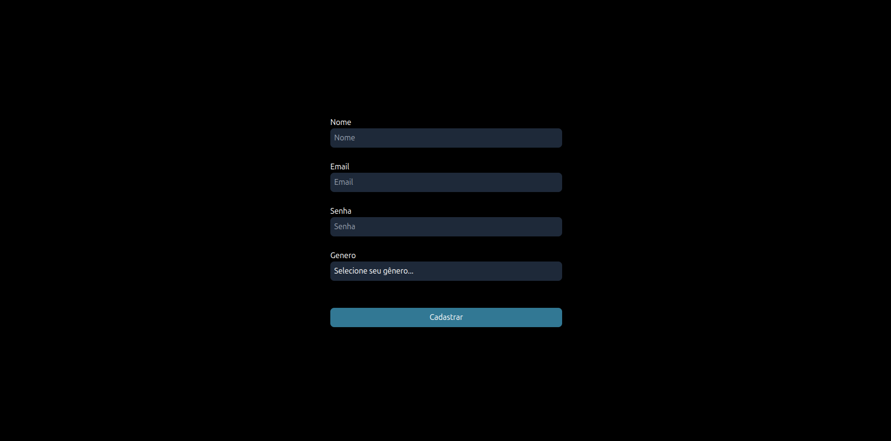

# Formulario

## Sobre o projeto

Este formulario com validação de dados desenvolvido com foco em boas práticas.

## Funcionalidades

- Validação de campos
- Interface responsiva
- controle de estado com react

## Tecnologias usadas

- Vite 
- React 
- TailWind CSS

## Como rodar

git clone https://github.com/renanmiguel2/ToDoList
cd ToDoList
npm install
npm run dev

## Requisitos 

Node.js 17+

## Preview

## Acesso meu projeto

https://rnformulario.netlify.app/